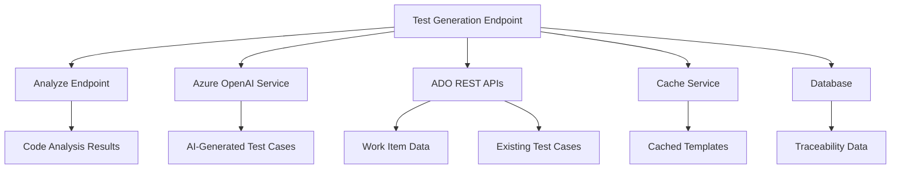

# Test Case Generation Endpoint - Technical Specification

## 1. API Endpoint Specification

### 1.1 REST API Contract

**Endpoint:** `POST /generate-tests`

**HTTP Method:** POST

**Content-Type:** `application/json`

**Authentication:** Bearer Token (Azure DevOps PAT)

### 1.2 Request Schema

```json
{
  "type": "object",
  "required": ["pull_request_id", "code_analysis", "ado_config"],
  "properties": {
    "pull_request_id": {
      "type": "string",
      "description": "Pull request identifier",
      "pattern": "^[0-9]+$"
    },
    "code_analysis": {
      "type": "object",
      "required": ["summary", "changed_components", "risk_level"],
      "properties": {
        "summary": {
          "type": "string",
          "maxLength": 2000
        },
        "changed_components": {
          "type": "array",
          "items": {
            "type": "object",
            "required": ["file_path", "methods", "risk_level"],
            "properties": {
              "file_path": {"type": "string"},
              "methods": {
                "type": "array",
                "items": {
                  "type": "object",
                  "required": ["name", "summary", "change_type"],
                  "properties": {
                    "name": {"type": "string"},
                    "summary": {"type": "string"},
                    "change_type": {
                      "type": "string",
                      "enum": ["added", "modified", "removed"]
                    }
                  }
                }
              },
              "risk_level": {
                "type": "string",
                "enum": ["low", "medium", "high", "critical"]
              }
            }
          }
        },
        "dependency_chains": {
          "type": "array",
          "items": {
            "type": "object",
            "properties": {
              "file_path": {"type": "string"},
              "impacted_files": {
                "type": "array",
                "items": {
                  "type": "object",
                  "properties": {
                    "file_path": {"type": "string"},
                    "change_impact": {"type": "string"}
                  }
                }
              }
            }
          }
        },
        "risk_level": {
          "type": "string",
          "enum": ["low", "medium", "high", "critical"]
        }
      }
    },
    "ado_config": {
      "type": "object",
      "required": ["work_item_id"],
      "properties": {
        "work_item_id": {
          "type": "integer",
          "minimum": 1
        },
        "project_name": {
          "type": "string",
          "maxLength": 100
        },
        "organization": {
          "type": "string",
          "maxLength": 100
        }
      }
    },
    "test_generation_options": {
      "type": "object",
      "properties": {
        "include_ui_tests": {
          "type": "boolean",
          "default": true
        },
        "include_api_tests": {
          "type": "boolean",
          "default": true
        },
        "max_test_cases": {
          "type": "integer",
          "minimum": 1,
          "maximum": 50,
          "default": 20
        },
        "test_frameworks": {
          "type": "array",
          "items": {
            "type": "string",
            "enum": ["xunit", "nunit", "jest", "cypress", "selenium"]
          }
        }
      }
    }
  }
}
```

### 1.3 Response Schema

```json
{
  "type": "object",
  "required": ["test_generation_id", "generated_tests", "existing_tests", "traceability_matrix"],
  "properties": {
    "test_generation_id": {
      "type": "string",
      "description": "Unique identifier for this test generation session"
    },
    "generated_tests": {
      "type": "object",
      "properties": {
        "api_tests": {
          "type": "array",
          "items": {
            "$ref": "#/definitions/TestCase"
          }
        },
        "ui_tests": {
          "type": "array",
          "items": {
            "$ref": "#/definitions/TestCase"
          }
        },
        "integration_tests": {
          "type": "array",
          "items": {
            "$ref": "#/definitions/TestCase"
          }
        }
      }
    },
    "existing_tests": {
      "type": "object",
      "properties": {
        "linked_test_cases": {
          "type": "array",
          "items": {
            "$ref": "#/definitions/AdoTestCase"
          }
        },
        "test_suites": {
          "type": "array",
          "items": {
            "$ref": "#/definitions/TestSuite"
          }
        }
      }
    },
    "traceability_matrix": {
      "type": "object",
      "properties": {
        "work_item_hierarchy": {
          "$ref": "#/definitions/WorkItemHierarchy"
        },
        "test_coverage_map": {
          "type": "object",
          "additionalProperties": {
            "type": "array",
            "items": {"type": "string"}
          }
        }
      }
    },
    "recommendations": {
      "type": "object",
      "properties": {
        "priority_tests": {
          "type": "array",
          "items": {"type": "string"}
        },
        "coverage_gaps": {
          "type": "array",
          "items": {"type": "string"}
        },
        "automation_candidates": {
          "type": "array",
          "items": {"type": "string"}
        }
      }
    }
  },
  "definitions": {
    "TestCase": {
      "type": "object",
      "required": ["id", "title", "description", "priority", "category", "test_steps"],
      "properties": {
        "id": {"type": "string"},
        "title": {"type": "string", "maxLength": 200},
        "description": {"type": "string", "maxLength": 1000},
        "priority": {
          "type": "string",
          "enum": ["Critical", "High", "Medium", "Low"]
        },
        "category": {
          "type": "string",
          "enum": ["API", "UI", "Integration", "Unit", "Performance", "Security"]
        },
        "test_steps": {
          "type": "array",
          "items": {
            "type": "object",
            "required": ["step_number", "action", "expected_result"],
            "properties": {
              "step_number": {"type": "integer"},
              "action": {"type": "string"},
              "expected_result": {"type": "string"},
              "test_data": {"type": "string"}
            }
          }
        },
        "preconditions": {"type": "string"},
        "test_data_requirements": {
          "type": "array",
          "items": {"type": "string"}
        },
        "automation_feasibility": {
          "type": "string",
          "enum": ["High", "Medium", "Low", "Manual Only"]
        },
        "estimated_duration": {"type": "integer"},
        "tags": {
          "type": "array",
          "items": {"type": "string"}
        },
        "related_code_files": {
          "type": "array",
          "items": {"type": "string"}
        }
      }
    },
    "AdoTestCase": {
      "type": "object",
      "properties": {
        "id": {"type": "integer"},
        "title": {"type": "string"},
        "state": {"type": "string"},
        "assigned_to": {"type": "string"},
        "area_path": {"type": "string"},
        "iteration_path": {"type": "string"},
        "test_suite_id": {"type": "integer"},
        "last_execution_outcome": {"type": "string"}
      }
    },
    "TestSuite": {
      "type": "object",
      "properties": {
        "id": {"type": "integer"},
        "name": {"type": "string"},
        "test_case_count": {"type": "integer"},
        "parent_suite_id": {"type": "integer"}
      }
    },
    "WorkItemHierarchy": {
      "type": "object",
      "properties": {
        "epic": {
          "type": "object",
          "properties": {
            "id": {"type": "integer"},
            "title": {"type": "string"}
          }
        },
        "feature": {
          "type": "object",
          "properties": {
            "id": {"type": "integer"},
            "title": {"type": "string"}
          }
        },
        "user_story": {
          "type": "object",
          "properties": {
            "id": {"type": "integer"},
            "title": {"type": "string"},
            "acceptance_criteria": {"type": "string"}
          }
        },
        "tasks": {
          "type": "array",
          "items": {
            "type": "object",
            "properties": {
              "id": {"type": "integer"},
              "title": {"type": "string"},
              "state": {"type": "string"}
            }
          }
        }
      }
    }
  }
}
```

### 1.4 Error Response Schema

```json
{
  "type": "object",
  "required": ["error_code", "message", "timestamp"],
  "properties": {
    "error_code": {
      "type": "string",
      "enum": [
        "INVALID_REQUEST",
        "ADO_CONNECTION_FAILED",
        "WORK_ITEM_NOT_FOUND",
        "INSUFFICIENT_PERMISSIONS",
        "AI_SERVICE_UNAVAILABLE",
        "RATE_LIMIT_EXCEEDED",
        "INTERNAL_SERVER_ERROR"
      ]
    },
    "message": {"type": "string"},
    "details": {"type": "string"},
    "timestamp": {"type": "string", "format": "date-time"},
    "request_id": {"type": "string"}
  }
}
```

### 1.5 Authentication and Authorization

**Authentication Method:** Bearer Token (Azure DevOps Personal Access Token)

**Required Headers:**
```
Authorization: Bearer <ADO_PAT_TOKEN>
Content-Type: application/json
X-Request-ID: <unique-request-id>
```

**Required ADO Permissions:**
- Work Items: Read
- Test Plans: Read, Write
- Code: Read
- Build: Read

### 1.6 Rate Limiting and Timeouts

- **Rate Limit:** 10 requests per minute per API key
- **Request Timeout:** 120 seconds
- **ADO API Timeout:** 30 seconds per call
- **AI Service Timeout:** 60 seconds

## 2. Core Functionality Specifications

### 2.1 AI-Powered Test Generation Algorithm

#### 2.1.1 Code Change Analysis Process

```
1. Parse code analysis input
2. Identify change patterns:
   - New methods/functions → Generate positive/negative test cases
   - Modified methods → Generate regression and edge case tests
   - Removed methods → Generate deprecation tests
   - UI changes → Generate user interaction tests
3. Analyze risk level and complexity
4. Generate test case templates based on patterns
5. Populate test cases with AI-generated content
```

#### 2.1.2 Test Case Categorization Logic

**API Tests:**
- Generated for backend methods, controllers, services
- Focus on input validation, business logic, error handling
- Include boundary value testing

**UI Tests:**
- Generated for frontend components, pages, user interactions
- Focus on user workflows, accessibility, responsive design
- Include cross-browser compatibility scenarios

**Integration Tests:**
- Generated for cross-component interactions
- Focus on data flow, API contracts, database operations

#### 2.1.3 Priority Assignment Criteria

```
Critical: 
- Security-related changes
- Payment/financial logic
- Data integrity operations
- Authentication/authorization

High:
- Core business logic
- User-facing functionality
- API contract changes
- Database schema modifications

Medium:
- Feature enhancements
- Performance optimizations
- UI/UX improvements

Low:
- Code refactoring
- Documentation updates
- Logging improvements
```

### 2.2 ADO Integration Logic

#### 2.2.1 Work Item Traversal Algorithm

```python
def traverse_work_item_hierarchy(work_item_id):
    """
    Navigate from Task → User Story → Feature → Epic
    """
    current_item = get_work_item(work_item_id)
    hierarchy = {}
    
    # Get parent relationships
    while current_item:
        hierarchy[current_item.type] = current_item
        parent_relations = get_parent_relations(current_item.id)
        current_item = parent_relations[0] if parent_relations else None
    
    return hierarchy
```

#### 2.2.2 Test Case Retrieval Process

```python
def get_existing_test_cases(work_item_id):
    """
    Retrieve linked test cases and test suites
    """
    # Get direct test case links
    test_links = get_test_case_links(work_item_id)
    
    # Get test suites containing related tests
    test_suites = get_test_suites_by_area_path(work_item.area_path)
    
    # Get test cases by tags/keywords
    keyword_tests = search_test_cases_by_keywords(work_item.title)
    
    return {
        'linked_tests': test_links,
        'suite_tests': test_suites,
        'keyword_tests': keyword_tests
    }
```

## 3. Technical Implementation Requirements

### 3.1 ADO REST API Integration Points

#### 3.1.1 Required API Endpoints

```
Work Items:
- GET https://dev.azure.com/{organization}/{project}/_apis/wit/workitems/{id}
- GET https://dev.azure.com/{organization}/{project}/_apis/wit/workitems/{id}/relations

Test Management:
- GET https://dev.azure.com/{organization}/{project}/_apis/test/plans
- GET https://dev.azure.com/{organization}/{project}/_apis/test/suites/{suiteId}/testcases
- POST https://dev.azure.com/{organization}/{project}/_apis/test/testcases

Search:
- POST https://dev.azure.com/{organization}/{project}/_apis/search/workitemsearchresults
```

#### 3.1.2 Authentication Configuration

```python
class AdoClient:
    def __init__(self, organization, project, pat_token):
        self.base_url = f"https://dev.azure.com/{organization}/{project}/_apis"
        self.headers = {
            'Authorization': f'Basic {base64.b64encode(f":{pat_token}".encode()).decode()}',
            'Content-Type': 'application/json',
            'Accept': 'application/json'
        }
```

### 3.2 Error Handling Strategies

#### 3.2.1 ADO Connectivity Issues

```python
@retry(max_attempts=3, backoff_factor=2)
async def call_ado_api(endpoint, method='GET', data=None):
    try:
        response = await http_client.request(method, endpoint, json=data)
        if response.status_code == 401:
            raise AdoAuthenticationError("Invalid or expired PAT token")
        elif response.status_code == 403:
            raise AdoPermissionError("Insufficient permissions")
        elif response.status_code == 404:
            raise AdoResourceNotFoundError("Work item or resource not found")
        return response.json()
    except ConnectionError:
        raise AdoConnectionError("Unable to connect to Azure DevOps")
```

#### 3.2.2 AI Service Error Handling

```python
async def generate_test_cases_with_fallback(code_analysis):
    try:
        return await ai_service.generate_tests(code_analysis)
    except AIServiceUnavailableError:
        # Fallback to template-based generation
        return template_generator.generate_basic_tests(code_analysis)
    except AIRateLimitError:
        # Queue for later processing
        await queue_for_processing(code_analysis)
        return {"status": "queued", "estimated_completion": "5 minutes"}
```

### 3.3 Data Caching and Performance Optimization

#### 3.3.1 Caching Strategy

```python
# Cache ADO work item data for 15 minutes
@cache(ttl=900)
async def get_work_item_hierarchy(work_item_id):
    return await ado_client.get_work_item_with_relations(work_item_id)

# Cache test case templates for 1 hour
@cache(ttl=3600)
async def get_test_case_templates(category, framework):
    return await template_service.get_templates(category, framework)
```

#### 3.3.2 Performance Benchmarks

- **Response Time:** < 30 seconds for standard requests
- **Concurrent Requests:** Support 50 concurrent test generations
- **ADO API Calls:** Batch requests where possible, max 10 calls per generation
- **Memory Usage:** < 512MB per request

### 3.4 Security Considerations

#### 3.4.1 Data Protection

```python
class SecurityManager:
    def sanitize_code_content(self, code):
        # Remove sensitive patterns
        patterns = [
            r'password\s*=\s*["\'][^"\']+["\']',
            r'api_key\s*=\s*["\'][^"\']+["\']',
            r'connection_string\s*=\s*["\'][^"\']+["\']'
        ]
        for pattern in patterns:
            code = re.sub(pattern, '[REDACTED]', code, flags=re.IGNORECASE)
        return code
    
    def validate_ado_permissions(self, pat_token, required_scopes):
        # Validate token has required permissions
        pass
```

#### 3.4.2 Audit Logging

```python
async def log_test_generation_activity(request_data, response_data, user_context):
    audit_log = {
        'timestamp': datetime.utcnow(),
        'user_id': user_context.user_id,
        'organization': user_context.organization,
        'work_item_id': request_data.ado_config.work_item_id,
        'generated_test_count': len(response_data.generated_tests),
        'request_id': request_data.request_id
    }
    await audit_logger.log(audit_log)
```

## 4. Integration Architecture

### 4.1 System Dependencies



### 4.2 Data Flow Architecture

```
1. Receive test generation request
2. Validate request and ADO connectivity
3. Fetch code analysis from analyze endpoint
4. Retrieve work item hierarchy from ADO
5. Get existing test cases and suites
6. Generate AI-powered test cases
7. Create traceability matrix
8. Cache results and return response
9. Log audit trail
```

### 4.3 Database Schema Requirements

```sql
-- Test Generation Sessions
CREATE TABLE test_generation_sessions (
    id UUID PRIMARY KEY,
    pull_request_id VARCHAR(50),
    work_item_id INTEGER,
    organization VARCHAR(100),
    project VARCHAR(100),
    generated_at TIMESTAMP,
    test_count INTEGER,
    status VARCHAR(20)
);

-- Generated Test Cases
CREATE TABLE generated_test_cases (
    id UUID PRIMARY KEY,
    session_id UUID REFERENCES test_generation_sessions(id),
    title VARCHAR(200),
    description TEXT,
    category VARCHAR(50),
    priority VARCHAR(20),
    test_steps JSONB,
    related_files TEXT[]
);

-- Traceability Matrix
CREATE TABLE test_traceability (
    id UUID PRIMARY KEY,
    test_case_id UUID,
    work_item_id INTEGER,
    code_file_path VARCHAR(500),
    method_name VARCHAR(100),
    relationship_type VARCHAR(50)
);
```

## 5. Implementation Guidelines

### 5.1 Development Phases

**Phase 1: Core Infrastructure**
- Set up ADO client and authentication
- Implement basic test case generation
- Create database schema

**Phase 2: AI Integration**
- Integrate with Azure OpenAI
- Implement test case templates
- Add priority assignment logic

**Phase 3: Advanced Features**
- Implement traceability matrix
- Add caching and performance optimization
- Implement comprehensive error handling

**Phase 4: Testing and Optimization**
- Load testing and performance tuning
- Security testing and audit logging
- Documentation and deployment

### 5.2 Testing Strategy

**Unit Tests:**
- Test case generation algorithms
- ADO API integration methods
- Data validation and sanitization

**Integration Tests:**
- End-to-end test generation workflow
- ADO connectivity and permissions
- AI service integration

**Performance Tests:**
- Load testing with concurrent requests
- Memory usage and response time validation
- ADO API rate limiting compliance

### 5.3 Monitoring and Observability

**Key Metrics:**
- Test generation success rate
- Average response time
- ADO API call frequency
- AI service usage and costs
- Cache hit rates

**Alerting:**
- ADO connectivity failures
- AI service unavailability
- High error rates or timeouts
- Unusual usage patterns

This specification provides a comprehensive foundation for implementing the test case generation endpoint with proper ADO integration and AI-powered test creation capabilities.